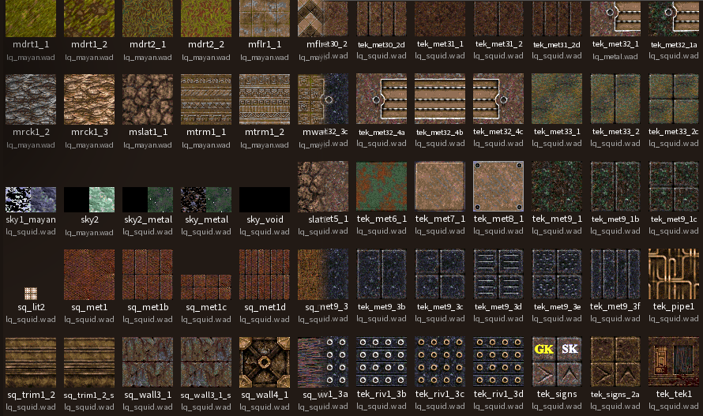
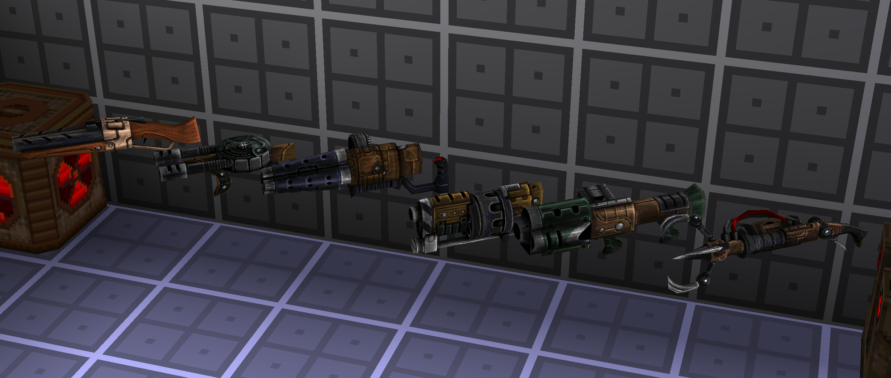

  ## [[Downloads/Releases]](https://github.com/MissLavender-LQ/LibreQuake/releases)
  # LibreQuake

The *LibreQuake* project aims to create a complete, free content first-person shooter game, but *LibreQuake* by itself is just the raw material for a game. It must be paired with a compatible engine to be played.

There is a massive [back catalogue](https://www.quaddicted.com), spanning over two decades, containing thousands of *Quake* levels and other modifications (“mods”) made by fans of the game. *LibreQuake* aims to be compatible with these and allows most to be played without the need to use non-free software.

The engine uses a directory called `id1/`, within that directory there are two archives called `pak0.pak` and `pak1.pak`, these archives contain all the game data except the soundtrack. While the *Quake* engine source code is free, you would usually still need one of the proprietary data files from [id Software](http://www.idsoftware.com) to play *Quake*. *LibreQuake* aims to create a free alternative: combined with the GPL-licensed *Quake* source code, this results in a completely free game.

### LibreQuakes Website [librequake.queer.sh](https://librequake.queer.sh).

# How to Play

Since *LibreQuake* is only the game data, you will still need to download an engine (or source port). One particularly recommended by the *LibreQuake* project is [FTEQW](https://fte.triptohell.info/downloads) This engine offers great support for both singleplayer multiplayer and the majority of mods created for both *Quake* and *LibreQuake*. [QuakeSpasmSpiked](https://triptohell.info/moodles/qss) and [Ironwail](https://github.com/andrei-drexler/ironwail/releases) are also good options. For even more options, see the [Quake Wiki](https://quakewiki.org/wiki/Engines).

Once you have downloaded an engine, paste the downloaded id1 (or lq1) folder in the same directory you put the engine executable. This is the executable you will run to start LibreQuake.

# What “Free” Means

When we speak of free content or software, we refer to the movement in which your freedom to use, copy, modify, and study a work is not infringed. For example, you may freely use *LibreQuake* for any purpose you see fit, you may redistribute it to anyone without needing to ask for permission, you may modify it (provided you keep the license intact, see `COPYING`), and you may study it. You may read more about free software at the [GNU](http://www.gnu.org/) and [Free Software Foundation](http://www.fsf.org) websites.

# Other Info

### Crediting information

*LibreQuake* is made up of submissions from many people all over the globe. All of them, including **you**, deserve credit! Please do not forget to provide your name and email when submitting resources.

### Using Git

You can also commit on a clone of the *LibreQuake* repository, although this is a technical task and it is okay to let other *LibreQuake* maintainers to do it instead: that is our normal mode of operation. However, pull requests are much appreciated and you may submit them in any manner you wish, with GitHub’s direct pull requests being the simplest, but by far not the only means.

*LibreQuake* uses the commit message style commonly seen in distributed version control systems, adopted by projects such as Linux and Git. For an explanation of this style, see [How to Write a Git Commit Message](https://chris.beams.io/posts/git-commit/).
